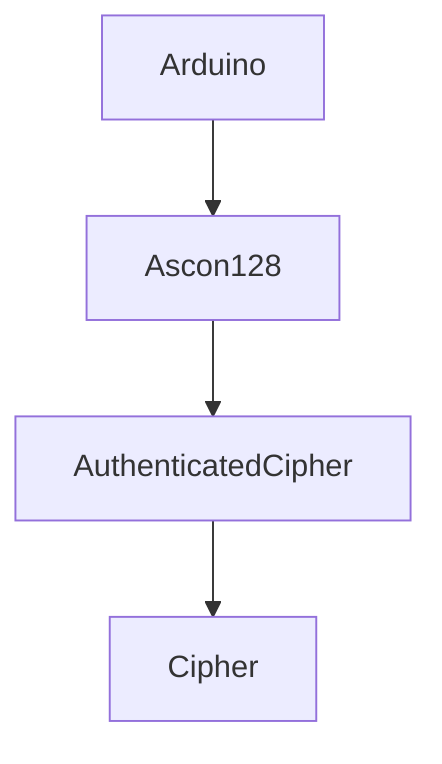

# Local Hardware Analysis
Source: https://rweather.github.io/lightweight-crypto/index.html

## System Architecture

```mermaid
  graph TD;
      AuthenticatedCipher-->Cipher;
      Ascon128-->AuthenticatedCipher;
      Arduino-->Ascon128;
```
